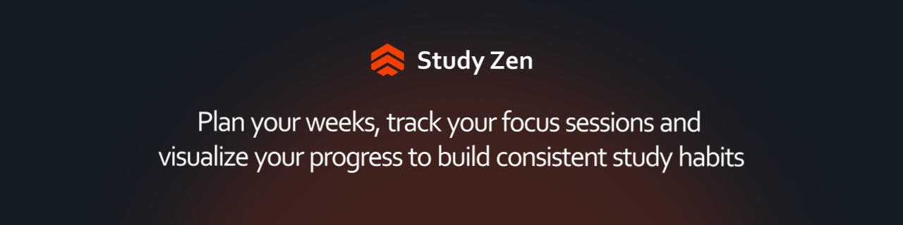
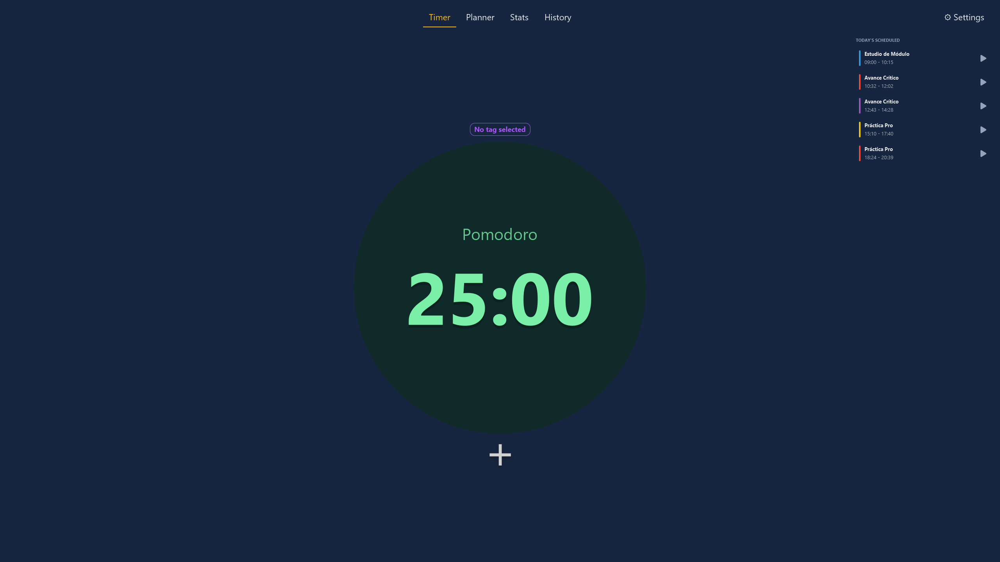
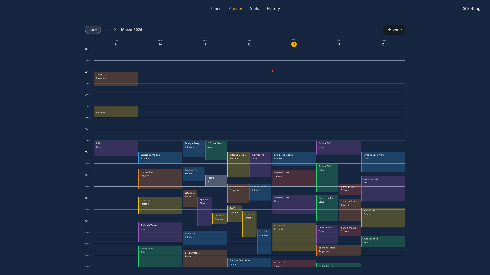
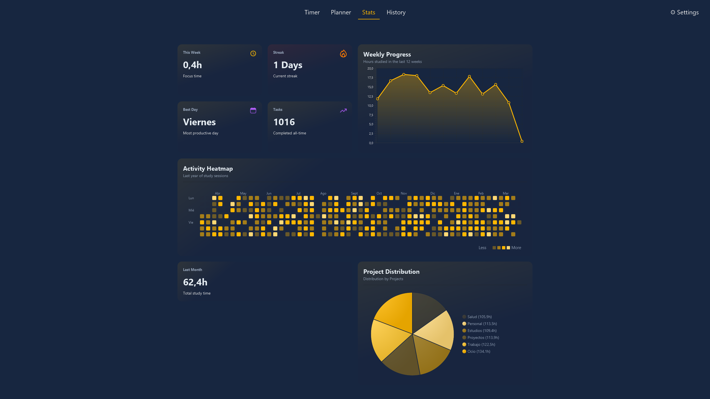
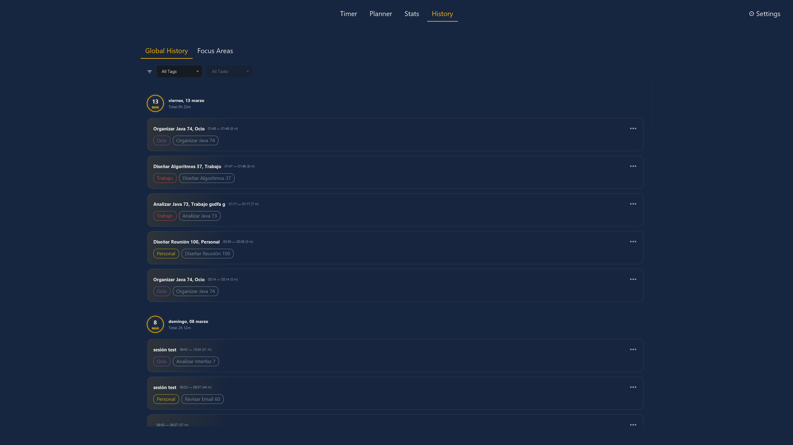
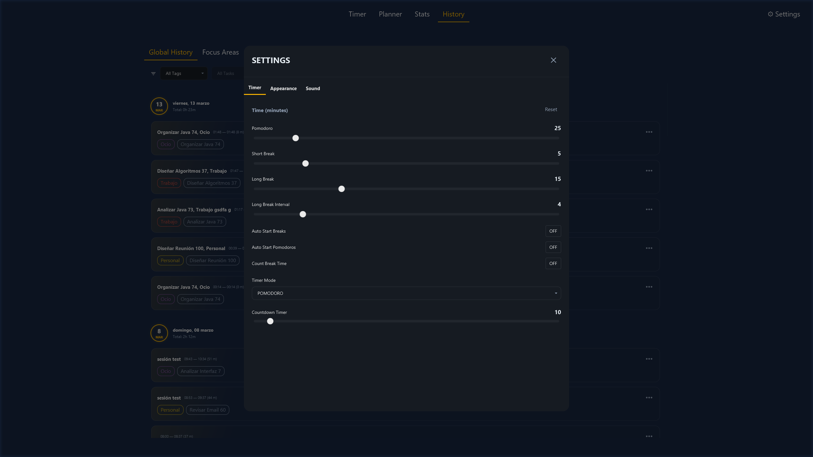

# 🎓 Study Tracker

> **⚠️ Work in Progress:** This project is currently under active development. Some features may be incomplete or subject to significant changes.

A modern, minimalist application designed to manage study time. It combines techniques like **Pomodoro**, **Timer**, and **Countdown** with a visual **Weekly Planner**, task tracking, and a **Spring Boot backend** with persistent cloud storage.

---

## ✨ Key Features

- **📅 Weekly Planner** — Visual calendar with support for overlapping sessions and intelligent day headers.
- **⏱️ Pomodoro System** — Integrated timer for focused study sessions with customizable intervals.
- **🏷️ Tag Management** — Organize studies by category with dynamic colors.
- **🔍 Fuzzy Search** — Quickly find tasks using a relevance-based search algorithm (FuzzyWuzzy).
- **🎨 Theme System** — 6 built-in themes: Dark, Light, Electric Blue, Catppuccin, Sunset, Midnight.
- **🌙 Modern UI** — Dark/Light modes with smooth animations, rounded corners, and dynamic borders.
- **📊 Stats Dashboard** — Heatmap, weekly chart, streak tracking, and project distribution.
- **☁️ REST Backend** — Spring Boot API with PostgreSQL for persistent, cross-device data storage.

---

## 🏗️ Project Structure

```
StudyTrackerProject/
├── backend/
│   ├── src/main/java/com/frandm/studytracker/backend/
│   │   ├── config/
│   │   ├── controller/
│   │   ├── mapper/
│   │   ├── model/
│   │   ├── repository/
│   │   ├── service/
│   │   └── BackendApplication.java
│   ├── src/main/resources/
│   │   ├── application.yml
│   │   └── db/migration/
│   ├── Dockerfile
│   └── pom.xml
│
├── frontend/
│   ├── src/main/java/com/frandm/studytracker/
│   │   ├── client/
│   │   ├── controllers/
│   │   ├── core/
│   │   ├── models/
│   │   ├── ui/
│   │   │   ├── util/
│   │   │   └── views/
│   │   ├── App.java
│   │   └── Launcher.java
│   ├── src/main/resources/com/frandm/studytracker/
│   │   ├── css/
│   │   ├── fxml/
│   │   ├── images/
│   │   ├── sounds/
│   │   └── videos/
│   └── pom.xml
│
├── images/
├── docker-compose.yml                ← DB + Backend services
├── Dockerfile                        ← Backend container
├── .env
├── .gitignore
└── pom.xml
```

---

## 🛠️ Tech Stack

| Layer | Technology |
|-------|-------|
| Frontend | Java 25, JavaFX 23|
| Backend | Java 21, Spring Boot 3.2|
| Database | PostgreSQL|
| Deployment | Docker|

---

## 🚀 Getting Started

### Prerequisites
- Java 21+ (backend), Java 25 (frontend)
- Maven 3.9+
- PostgreSQL or Docker

### Backend

```bash
cd backend
# Set environment variables
mvn spring-boot:run
```

Or with Docker:

```bash
docker-compose up -d
```

### Frontend

```bash
cd frontend
mvn javafx:run
```

Set `API_URL` environment variable to point to your backend:
```
API_URL=http://localhost:8080/api
```

---

## ⚙️ Environment Variables

Create a `.env` file at the project root:

```env
DB_HOST=localhost
DB_PORT=5432
DB_NAME=studytracker
DB_USER=your_user
DB_PASSWORD=your_password
SERVER_PORT=8080
API_URL=http://localhost:8080/api
```

---

## 📂 Local Data & Config

The frontend stores settings locally:

| OS | Location |
|----|---------|
| Windows | `C:\Users\<user>\.StudyTracker\settings.properties` |
| Linux/macOS | `/home/<user>/.StudyTracker/settings.properties` |

---

## 📸 Screenshots

|  |  |
|:-------------------------:|:--------------------------:|
|  |  |
|  |  |

---

Developed by Fran Dorado